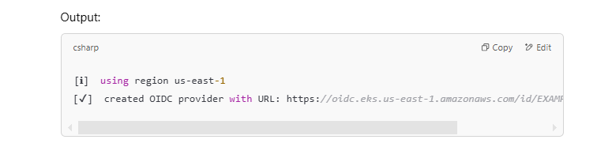
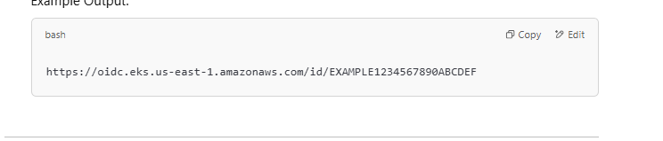

Kubernetes Ingress Controller as an Interface

The Kubernetes Ingress resource defines a generic API specification for managing HTTP(S) traffic routing to services within a Kubernetes cluster.

However, Kubernetes itself does not include an implementation of an Ingress Controller. It only provides the framework (the interface) for how traffic should be routed based on the Ingress resource.

Cloud Provider and Custom Implementations

Every cloud provider (and some third-party vendors) offers their own implementation of the Ingress Controller to work with their specific load balancing technologies. Each implementation translates the generic Kubernetes Ingress specification into actions specific to their infrastructure.

Here’s how it works:

* Kubernetes provides the Ingress specification as a common interface.

* Cloud providers (or third parties) provide the Ingress Controller as the implementation, which is responsible for:

    * Reading the Ingress resources in the cluster.

    * Configuring their underlying load balancers or proxies accordingly.

Why Does Each Provider Need Its Own Implementation?

1. **Different Load Balancers:** Each cloud provider uses its own load balancing technology (e.g., ALB for AWS, Google HTTP Load Balancer for GCP). The Ingress Controller must translate the Kubernetes Ingress rules into configurations compatible with the provider's load balancer.

2. **Cloud-Specific Features**: Different cloud providers offer unique features such as:

    * AWS: Web Application Firewall (WAF), ACM for SSL certificates.
    
    * GCP: Backend services and URL maps.
    
    * Azure: Path-based routing using Azure Application Gateway. Each implementation must support these features.

3. **Annotations:** Cloud providers extend the Kubernetes Ingress specification with annotations to allow users to specify cloud-specific configurations. For example:

    * AWS-specific annotation: alb.ingress.kubernetes.io/scheme: internet-facing
    
    * GCP-specific annotation: kubernetes.io/ingress.global-static-ip-name: my-static-ip

* Ingress: Acts as the interface or specification that defines routing rules for HTTP(S) traffic.

* Ingress Controller: Acts as the implementation that translates the Ingress specification into actions specific to a load balancer or proxy.

This separation of interface (Ingress) and implementation (Ingress Controller) allows Kubernetes to remain vendor-agnostic while still supporting the unique capabilities of each cloud provider.

-------------


***The AWS Load Balancer Controller is a Kubernetes controller that runs inside your EKS cluster as a deployment (just like any other Kubernetes application). It is deployed as a set of pods that monitor Kubernetes resources like Ingress and Service.***


**What resources does the AWS Load Balancer Controller need to access?**

The AWS Load Balancer Controller interacts with AWS services to manage load balancers and related networking resources on behalf of your EKS cluster. Here's a list of resources it commonly needs to access in AWS:

1. Elastic Load Balancers (ALBs or NLBs):

    * The controller creates and configures Application Load Balancers (ALBs) or Network Load Balancers (NLBs) when you create Ingress or Service resources in your EKS cluster.

2. Target Groups:

    * These are backend targets (EC2 instances, IP addresses, or pods) that the load balancer forwards traffic to. The controller configures these based on Kubernetes services.

3. VPC and Subnets:

    * The controller needs to identify and use the VPC and subnets where your EKS worker nodes are running so that it can associate load balancers and route traffic properly.

4. Security Groups:

    * The controller ensures that appropriate security group rules are applied to the load balancers so they can receive and forward traffic securely.
5. Route 53 (optional):

    * If you’re managing DNS records (e.g., setting up custom domain names for your Ingress), the controller might interact with Route 53 to configure DNS.

---------

# Installation


```
eksctl utils associate-iam-oidc-provider \
    --region us-east-1 \
    --cluster expense \
    --approve


```

This command associates an OIDC (OpenID Connect) provider with your EKS cluster. It enables your Kubernetes workloads (like pods) to securely assume AWS IAM roles without requiring AWS access keys.

Step-by-Step Explanation

1. Creates an OIDC Provider for the Cluster:

    * EKS clusters use IAM roles for service accounts to allow pods to interact securely with AWS resources.

    * OIDC is used as the bridge between Kubernetes service accounts and AWS IAM roles.
    * This command registers the OIDC provider for the cluster in AWS.

2. Allows Kubernetes to Use IAM Roles via OIDC:

    * Once the OIDC provider is associated, AWS can verify the service account's identity using the tokens issued by the Kubernetes API.
    * This is necessary to let Kubernetes workloads assume IAM roles securely without hardcoding AWS access keys.

3. Authorizes the OIDC Provider:

    * The --approve flag ensures the OIDC provider is automatically approved during the setup.


```
eksctl utils associate-iam-oidc-provider \
    --region us-east-1 \
    --cluster expense \
    --approve
```

Download an IAM policy for the LBC using one of the following commands:

```
curl -o iam-policy.json https://raw.githubusercontent.com/kubernetes-sigs/aws-load-balancer-controller/v2.11.0/docs/install/iam_policy.json

```

Create an IAM policy named AWSLoadBalancerControllerIAMPolicy. If you downloaded a different policy, replace iam-policy with the name of the policy that you downloaded.

```
aws iam create-policy \
    --policy-name AWSLoadBalancerControllerIAMPolicy \
    --policy-document file://iam-policy.json
```
Take note of the policy ARN that's returned.


Create an IAM role and Kubernetes ServiceAccount for the LBC. Use the ARN from the previous step.

```
eksctl create iamserviceaccount \
--cluster=expense \
--namespace=kube-system \
--name=aws-load-balancer-controller \
--attach-policy-arn=arn:aws:iam::528757792370:policy/AWSLoadBalancerControllerIAMPolicy \
--override-existing-serviceaccounts \
--region us-east-1 \
--approve

```

Add controller to cluster

```
helm repo add eks https://aws.github.io/eks-charts

```
```
helm install aws-load-balancer-controller eks/aws-load-balancer-controller -n kube-system --set clusterName=expense --set serviceAccount.create=false --set serviceAccount.name=aws-load-balancer-controller
```

# why oidc brigde is required between serviceaccount and iam role


The OIDC bridge between Kubernetes ServiceAccounts and AWS IAM Roles is required to enable secure, fine-grained access control for pods running in an Amazon EKS cluster. Let me explain step by step why this is needed:

1. Challenge: Secure Access to AWS Resources from Pods

    Pods in a Kubernetes cluster often need to access AWS services, like:

    S3 buckets
    DynamoDB tables
    RDS databases
    Secrets Manager
    SNS/SQS
    Load Balancers, etc.
    
By default, AWS IAM roles are designed to control access to AWS resources, but IAM roles are for AWS entities like EC2 instances, Lambda functions, or users, not Kubernetes pods.

So, we need a way to securely allow pods to assume specific IAM roles and access AWS services.

2. Why Not Use Instance IAM Roles?

Before OIDC integration, EKS clusters allowed pods to access AWS services by attaching an IAM role to the EC2 instances (nodes) hosting the cluster. However, this approach had limitations:

    Broad Permissions: All pods on the node inherited the same permissions as the node's IAM role, even if they didn’t need them.

    Security Risk: A compromised pod could misuse those permissions.

    No Fine-Grained Control: It was hard to restrict permissions for individual pods or workloads.

3. Solution: ServiceAccount + IAM Role with OIDC

The OIDC bridge solves these issues by linking Kubernetes ServiceAccounts with AWS IAM Roles. Here's why this is necessary:

a) ServiceAccount and Workload Identity

    Kubernetes ServiceAccounts are identities for pods in a cluster.

    Each pod can be assigned a unique ServiceAccount, which provides a way to identify that pod within the cluster.

b) OIDC Authentication

    AWS uses OpenID Connect (OIDC), a standard protocol for authenticating and verifying identities.

    Kubernetes issues an OIDC-compatible JWT token for each ServiceAccount. This token acts as a "proof of identity" for pods using that ServiceAccount.

    AWS verifies this token to ensure the request is coming from the right ServiceAccount in the cluster.

c) IAM Role Trust Policy

    AWS IAM roles can have trust policies specifying who can assume the role.

    When you enable OIDC in your EKS cluster, AWS allows you to configure an IAM role to trust Kubernetes ServiceAccounts via OIDC.

d) Fine-Grained Permissions

    With OIDC, you can map a specific Kubernetes ServiceAccount to a specific IAM role.

    This means only the pods using that ServiceAccount get the IAM permissions defined in the role.

4. How the OIDC Bridge Works

Here’s how the OIDC bridge operates step by step:

Associate an OIDC Provider:

***Using eksctl or the AWS Management Console, you associate an OIDC provider with your EKS cluster.
This allows AWS to trust the tokens issued by the Kubernetes API server.
***

Create a Kubernetes ServiceAccount:

You create a ServiceAccount in Kubernetes and annotate it with the corresponding IAM role ARN.

Pod Uses the ServiceAccount:

A pod in your cluster is configured to use the ServiceAccount.
Kubernetes mounts a token (JWT) for the ServiceAccount into the pod.

Pod Makes an AWS Request:

The pod sends an API request to AWS and includes the JWT token in the request.
The token proves the pod’s identity to AWS.

AWS Verifies the Token:

AWS checks the token using the OIDC provider to confirm:

It was issued by the EKS cluster.

It belongs to the correct ServiceAccount.

AWS then allows the pod to assume the mapped IAM role.

Pod Gains Temporary AWS Credentials:

After assuming the IAM role, the pod gets temporary AWS credentials that allow it to interact with AWS services securely.

----

The Kubernetes Issuer URL is a unique URL associated with the OpenID Connect (OIDC) provider for your EKS cluster. This URL is used to identify your Kubernetes cluster to AWS and validate tokens issued by the Kubernetes API server for service accounts.

Structure of the Issuer URL

For Amazon EKS, the OIDC Issuer URL follows this format:

```
https://oidc.eks.<region>.amazonaws.com/id/<OIDC-ID>

```

Using eksctl: If you associated the OIDC provider using eksctl, it provides the OIDC URL:

```
eksctl utils associate-iam-oidc-provider --region <region> --cluster <cluster-name> --approve
```
Output:





Why Is the Issuer URL Important?

Token Validation:

The Issuer URL identifies the source of the JWT tokens issued by the Kubernetes API server for service accounts.

AWS uses this URL to retrieve the public keys (from the JWKS endpoint) to validate the signature of the JWT.

IAM Role Trust Policy:

The trust relationship of IAM roles relies on the OIDC Issuer URL. It ensures that only tokens from your cluster's service accounts can assume specific roles.